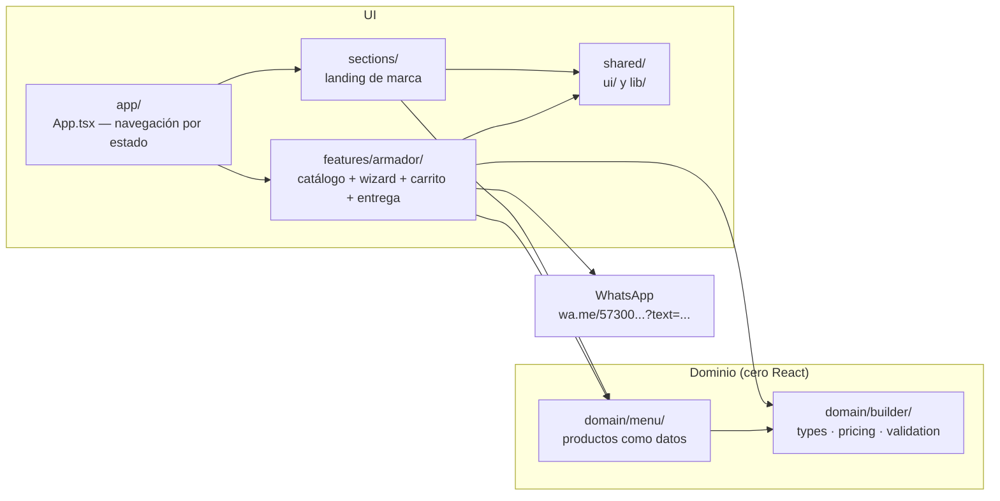
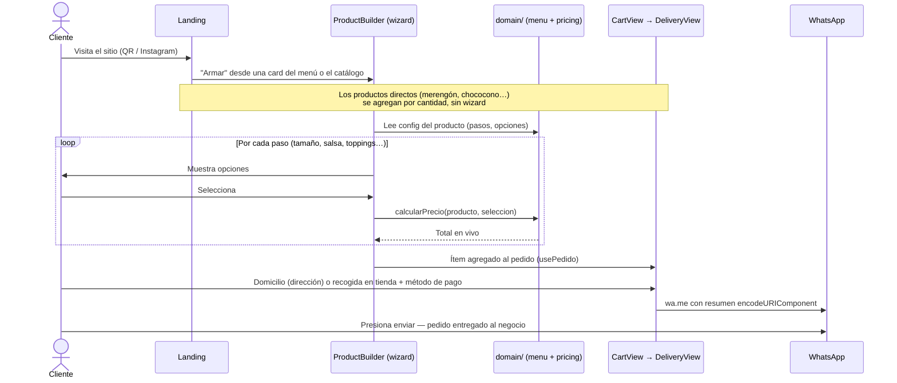

# D'Fruta Madre — Landing + Armador de Pedidos

> Landing de marca y mini-app de pedidos por WhatsApp para D'Fruta Madre, fresas con crema a domicilio en Girardota, Antioquia.


---

## 1. Project Overview

D'Fruta Madre vende fresas con crema y derivados, y toma todos sus pedidos por WhatsApp. Este proyecto convierte ese flujo manual en uno guiado: la página **convence** (landing de marca con menú, prueba social y contacto) y luego **construye el pedido completo** con "el armador" — un catálogo con todo el menú a domicilio donde los productos configurables (fresas, duraznos, salpiconada) se arman con un wizard paso a paso y los directos (merengón, chococono…) se agregan por cantidad. El resumen llega a WhatsApp listo para enviar.

La mayoría de los usuarios llega desde el celular (QR en el punto físico / Instagram), por eso todo el diseño es mobile-first y el contenido está 100 % en español.

---

## 2. Architecture Overview

### Diagram

Feature-based con una **capa de dominio puro**: la lógica de negocio (motor del armador, precios, menú) vive aislada y sin React. Las dependencias apuntan siempre hacia el dominio, nunca hacia afuera.



### Architecture Decisions

#### ADR-001: Motor de armado genérico configurado por datos

- **Decisión:** El wizard no conoce ningún producto en concreto. Cada producto del menú se describe como un objeto de configuración que el motor (`<ProductBuilder producto={config} />`) sabe renderizar; los productos de precio fijo se modelan aparte como producto directo, sin wizard.
- **Contexto:** Cada producto tiene un proceso de armado distinto — varían los pasos, las reglas de selección y cómo se compone el precio. Hardcodear un flujo por producto duplicaría UI y lógica con cada lanzamiento del negocio.
- **Consecuencias:** Agregar o modificar un producto es editar datos en `domain/menu/`, sin tocar el motor ni la UI (Open/Closed). La apuesta ya se validó: el armador nació con un solo producto y hoy cubre todo el menú a domicilio con el mismo motor. El costo es un modelo de configuración más abstracto que un formulario hecho a mano.

#### ADR-002: Sin backend — handoff a WhatsApp

- **Decisión:** No hay servidor, base de datos ni pagos online. El pedido vive en memoria y se entrega como enlace `wa.me/<número>?text=<resumen codificado>`; el cliente solo presiona enviar.
- **Contexto:** El negocio ya opera por WhatsApp. Un checkout propio agregaría infraestructura, costo y fricción sin valor en esta etapa.
- **Consecuencias:** Cero costo de operación y despliegue trivial. Se acepta no tener historial de pedidos ni analytics de conversión, y el mensaje debe mantenerse compacto (límite práctico de longitud de URL).

#### ADR-003: Dominio puro sin React, testeado con Vitest

- **Decisión:** Precios, validación y menú son funciones y datos puros en `domain/`, sin dependencia de React ni de las capas de UI. La regla de dependencias apunta siempre hacia el dominio.
- **Contexto:** Las reglas de precio y armado son la parte del sistema que más cambia y la más costosa de romper. Acoplarlas a componentes obligaría a montar UI para probarlas y esparciría la lógica por las vistas.
- **Consecuencias:** Las reglas se testean con unit tests en Node sin montar componentes, y un cambio de precios es editar un archivo de datos. La regla de dependencias es inviolable: si un componente se importa dentro de `domain/`, un límite se rompió.

#### ADR-004: Prerender estático en build (sin SSR)

- **Decisión:** `vite-prerender-plugin` genera el HTML en `npm run build` llamando a `prerender()` en `main.tsx`; en el navegador se hidrata con `hydrateRoot` si el HTML ya viene renderizado.
- **Contexto:** Una SPA vacía perjudica SEO y primer pintado en un sitio cuyo tráfico entra por búsqueda local e Instagram. Un servidor SSR sería sobredimensionado para una página estática.
- **Consecuencias:** HTML indexable con costo de hosting estático. Gotcha documentado en `main.tsx`: el prerender usa `react-dom/server.edge` porque los builds de navegador de React 19 cuelgan el proceso de build en Node ([react#32965](https://github.com/facebook/react/issues/32965)).

#### ADR-005: Navegación por estado en memoria, sin router

- **Decisión:** `App.tsx` alterna vistas (`landing → catalog → armador → cart → delivery → whatsapp`) con un `useState<View>`, sin librería de routing ni URLs por vista.
- **Contexto:** El flujo es un funnel lineal de una sola sesión; no se necesita deep-linking a pasos intermedios ni historial navegable.
- **Consecuencias:** Cero dependencias y transición de vistas trivial. Se acepta que refrescar la página reinicia el pedido y que los pasos del wizard no son enlazables.

---

## 3. Scope & Boundaries

### En scope

- Landing de marca: hero, menú con precios, cómo pedir, prueba social, contacto.
- Catálogo con todo el menú a domicilio: configurables con wizard (fresas con crema, duraznos con crema, salpiconada) y directos por cantidad (merengón, mermelada, vaso de crema, chococono, agua).
- Entrada al flujo desde las cards del menú de la landing: abren el wizard con preselección (ej. tamaño) o suman un producto directo al carrito sin salir de la landing.
- Carrito multi-ítem heterogéneo: varios configurables con distinta selección, directos con cantidad, edición y eliminación.
- Entrega: domicilio (dirección obligatoria + referencia) o **recogida en tienda** (nombre de quien recoge); pago en efectivo (con "paga con" para vueltas) o transferencia. Generación del mensaje de WhatsApp.
- SEO: prerender estático, JSON-LD, `robots.txt`, `sitemap.xml`, Open Graph.

### Fuera de scope

- **No procesa pagos** — la transacción ocurre por fuera, en el chat de WhatsApp.
- **No persiste pedidos** — sin base de datos, sin historial; refrescar la página reinicia el pedido.
- **No hay cuentas de usuario ni autenticación.**
- **No hay panel de administración** — cambiar precios o menú es editar archivos de datos en `domain/menu/`.
- Domicilios solo en Girardota; la app no calcula cobertura ni tarifas de envío.

### Extensiones futuras

- Más productos vía configuración en `domain/menu/` (registro `PRODUCTOS_CONFIGURABLES` / `PRODUCTOS_DIRECTOS`), sin tocar el motor.
- La oblea es solo punto físico; no entra al armador de domicilios.

---

## 4. Tech Stack

| Tecnología | Versión | Rol | Por qué |
|---|---|---|---|
| React | 19.x | UI | Component model para el wizard multi-paso; `hydrateRoot` para hidratar el HTML prerenderizado |
| TypeScript | 6.x (strict) | Lenguaje | Uniones literales y discriminadas modelan el dominio (tamaños, tipos de paso) sin estados imposibles |
| Vite | 8.x | Build tool | HMR instantáneo en dev y build optimizado sin configuración extra |
| Tailwind CSS | 4.x | Estilos | Config CSS-first con `@theme` (sin `tailwind.config.js`); consistencia mobile-first |
| Vitest | 4.x | Tests | Unit tests del dominio puro en entorno Node, sin montar componentes |
| vite-prerender-plugin | 0.5.x | Prerender | HTML estático indexable en build, sin servidor SSR |
| Vercel | — | Deploy | CI/CD desde Git, hosting estático para `dist/` |

---

## 5. Project Structure

```
src/
├── app/                     # Arranque: main.tsx (mount + prerender), App.tsx (navegación), JsonLd, CSS global
├── domain/                  # Lógica pura de negocio — CERO React, las dependencias apuntan hacia acá
│   ├── builder/             # Motor genérico: types.ts, pricing.ts (+ tests), validation.ts
│   └── menu/                # Productos como datos + registro: fresas-con-crema.ts, duraznos-con-crema.ts,
│                            #   salpiconada.ts, marca.ts, imagenes.ts, index.ts (PRODUCTOS_CONFIGURABLES/DIRECTOS)
├── features/
│   └── armador/             # Mini-app de pedidos: ProductCatalog (catálogo), ProductBuilder (wizard),
│                            #   components/ (carrito, entrega, WhatsApp, steppers), hooks/usePedido, whatsapp.ts
├── sections/                # Secciones de la landing de marca (Hero, MenuSection, ComoPedir…)
└── shared/                  # Transversal: ui/ (sistema visual) y lib/ (cn, formato es-CO, helper wa.me)
public/assets/               # Imágenes del menú y la marca (webp)
```

La separación `sections`/`features`/`domain` sigue feature-based architecture con regla de dependencias hacia el dominio: la UI orquesta, el dominio decide. Nunca se hardcodean precios ni textos del menú en la UI — todo sale de `domain/menu/`.

---

## 6. Data Flow

Happy path de un pedido desde la landing:



---

## 7. Setup & Installation

### Requisitos previos

- Node.js >= 18
- npm >= 9

### Instalación

```bash
git clone https://github.com/hydreon-devs/web-dfrutamadre.git
cd web-dfrutamadre
npm install
npm run dev
```

### Scripts disponibles

| Comando | Descripción |
|---|---|
| `npm run dev` | Servidor de desarrollo con HMR |
| `npm run build` | `tsc -b` + build de producción con prerender en `dist/` |
| `npm run preview` | Preview del build de producción |
| `npm run test` | Tests del dominio con Vitest |
| `npm run test:watch` | Vitest en modo watch |
| `npm run lint` | ESLint |

No hay variables de entorno: el número de WhatsApp y los datos de marca viven como datos del dominio.

---

## 8. Contributing

- Commits con [Conventional Commits](https://www.conventionalcommits.org/) (`feat:`, `fix:`, `docs:`…); el versionado y el `CHANGELOG.md` los gestiona release-please.
- Convenciones de código, nombres y reglas de negocio completas: ver [`AGENTS.md`](./AGENTS.md).
- Collaborators: Carlos Quiroz Muñoz -> [carlosqm-dev](https://github.com/carlosqm-dev/)
